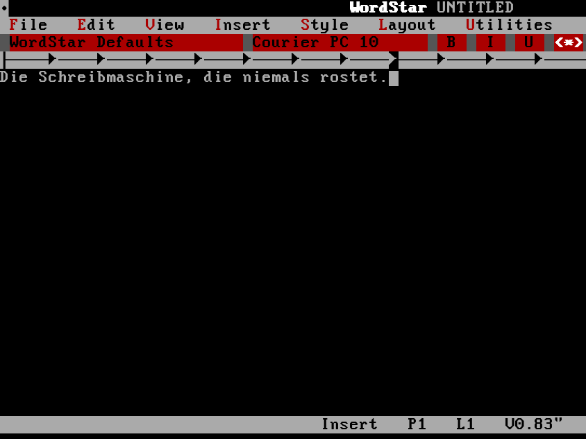

# WordStar 7.0 (DOS) unter Linux — mit DOSBox-X

*Das legendäre WordStar 7.0 für DOS — gestochen scharf, mit deutscher Tastatur
und Umlauten, so eingerichtet, dass es sauber speichert und sogar als PDF
„druckt". Auf modernem Linux.*



> **🇬🇧 English speakers:** this project is written **German-first** (I'm German),
> but it works exactly the same in English. A full **English section — including
> how to switch the keyboard to US/English — is at the [bottom](#english). 👇**

---

## Ehrliches Vorwort

Ich bin **kein Programmierer**. Ich wollte einfach mein geliebtes WordStar
wieder benutzen. Den technischen Teil hat mir
**[Claude Code](https://claude.com/claude-code)** gebaut — ich habe gesagt, was
ich will, und getestet, ob es klappt. Ich veröffentliche es, weil vielleicht
jemand anderes auch Freude daran hat. 🙂

---

## Warum überhaupt? Und was war das Problem?

DOSBox-X startet WordStar an sich problemlos. Es gab aber drei Stolpersteine,
die hier alle gelöst sind:

1. **Speichern ging nicht** („Datenträger voll"). Ursache: DOSBox reicht dem
   alten DOS deine **riesige moderne Festplatte** durch; das 16-Bit-WordStar
   verrechnet sich und denkt, es sei kein Platz. **Lösung:** WordStar bekommt
   eine **eigene 600-MB-Festplatte** (ein FAT16-Image). Der Installer baut sie
   automatisch aus deinen WordStar-Dateien.
2. **Deutsche Tastatur & Umlaute** — ist eingestellt (`keyboardlayout = gr`,
   Codepage 858). ä ö ü ß und y/z sitzen richtig.
3. **Scharfe Schrift auf HiDPI** — über den TTF-Textmodus von DOSBox-X mit der
   mitgelieferten DOS-Schrift *Nouveau_IBM*.

Und als Bonus: **Drucken → PDF.** WordStar druckt mit seinem PostScript-Treiber
auf „LPT1", DOSBox-X fängt das ab, und daraus wird automatisch ein PDF in
`~/Dokumente/wordstar` (siehe unten).

---

## Voraussetzungen

- **DOSBox-X**, **mtools** und **rsync** (für den PDF-Druck außerdem
  **Ghostscript**, das `ps2pdf` liefert)
- Deine eigene Kopie von **WordStar 7.0 für DOS** (siehe nächster Abschnitt)

| Distribution   | Befehl |
|----------------|--------|
| Arch / Manjaro | `sudo pacman -S mtools rsync` + `dosbox-x` aus dem AUR (`yay -S dosbox-x`) |
| Debian / Ubuntu| `sudo apt install dosbox-x mtools rsync` |
| Fedora         | `sudo dnf install dosbox-x mtools rsync` |

Für den PDF-Druck zusätzlich `ghostscript`.

---

## Woher bekomme ich WordStar 7?

WordStar 7.0 ist **nicht** in diesem Repo. Die gute Nachricht: der
Science-Fiction-Autor **Robert J. Sawyer** hat mit Erlaubnis das komplette
**„Complete WordStar 7.0 Archive"** kostenlos veröffentlicht — inklusive
Programm, Handbüchern und Druckertreibern:

- **Sawyers Seite:** <https://www.sfwriter.com/ws7.htm>
- **Internet Archive:** <https://archive.org/details/sawyer-wordstar-7-archive-20240812>

Lade das Archiv herunter und **entpacke** es. Du brauchst am Ende den Ordner
**`WS`** (darin liegt `WS.EXE`). Genau diesen Pfad fragt der Installer ab. Die
riesigen Handbuch-/Windows-Ordner lässt der Installer automatisch weg — nur der
DOS-Teil kommt ins Image.

---

## Installation

```sh
git clone https://github.com/drdewes/wordstar-on-linux.git
cd wordstar-on-linux
./install.sh
```

Das Skript fragt dich nach dem `WS`-Ordner, baut die 600-MB-Festplatte und legt
alles an seinen Platz. Danach:

```sh
wordstar
```

**Oder: deine KI macht's für dich.** Wenn du [Claude Code](https://claude.com/claude-code)
hast, öffne **[`CLAUDE-PROMPT.md`](CLAUDE-PROMPT.md)**, kopiere den Text daraus in
Claude Code — die KI klont das Repo, prüft alles, fragt nach deinen
WordStar-Dateien und richtet es komplett ein.

---

## Benutzung

| Befehl | Was es tut |
|--------|------------|
| `wordstar` | startet WordStar 7.0 |
| `ws-docs` | holt deine Texte aus WordStars Festplatte nach `~/Dokumente/wordstar` (Menü mit `fzf`) |
| `ws-docs list` | zeigt, was in WordStars `C:\TEXTE` liegt |
| `ws-docs import DATEI` | legt eine Linux-Datei in WordStars Festplatte |

**Wichtig zum Speichern:** WordStar startet im Ordner `C:\TEXTE` — speichere
deine Texte dort. Sie liegen dann *innerhalb* der Festplatte; mit `ws-docs`
holst du sie bequem nach Linux (bzw. in deine Dropbox).

**Drucken → PDF:** Drucke in WordStar mit dem **PostScript-Treiber** (`^P`, dann
den PS-Treiber wählen). Das Ergebnis landet automatisch als PDF in
`~/Dokumente/wordstar`. Wer einen echten Drucker ansteuern will, startet mit
`WS_PRINT_MODE=print wordstar` (Standard-Drucker über `WS_PRINTER` einstellbar).

**Screenshot-Tipp:** WordStar startet im Vollbild. Für ein Bildschirmfoto lieber
im **Fenster** starten, das ist auf manchen Grafikchips stabiler:

```sh
wordstar -set "sdl fullscreen=false"
```

---

## Was ist hier drin?

```
install.sh                       der Einrichter (baut die 600-MB-Festplatte)
config/dosbox-x-wordstar.conf    die fertige DOSBox-X-Konfiguration
scripts/wordstar                 Starter für WordStar
scripts/ws-docs                  Dokumente rein/raus
scripts/ws-lpt-print             fängt WordStars Druck ab → PDF
CLAUDE-PROMPT.md                 Text zum Einfügen in Claude Code (KI richtet ein)
```

Es wird **nichts** aus dem Internet nachgeladen und **kein** root/sudo für die
Einrichtung selbst gebraucht.

---

## Lizenz

Konfiguration, Skripte und Anleitung: **MIT** (siehe `LICENSE`).
**WordStar 7.0 selbst ist nicht enthalten** und gehört seinen Rechteinhabern;
es stammt aus Robert J. Sawyers frei verfügbarem Archiv (oben verlinkt).

**Verwandtes Projekt:** Dasselbe für **MS Word 5.5 für DOS** →
[word55-on-linux](https://github.com/drdewes/word55-on-linux).

---

## English

This project is **written in German first** — the author (Holger, a happy
non-programmer) built it for himself with
[Claude Code](https://claude.com/claude-code) and published it under MIT in case
someone else enjoys it too. Everything works **exactly the same in English**;
only a few labels and folder names are German. Here's the gist:

**What it does.** Run the legendary **WordStar 7.0 for DOS** on modern Linux via
DOSBox-X. Three things are pre-solved: (1) saving used to fail ("disk full")
because DOSBox hands 16-bit WordStar your huge modern drive — so WordStar gets
its own **600 MB FAT16 disk image**, built automatically by the installer;
(2) crisp TTF text on HiDPI; (3) it even **"prints" to PDF** (WordStar prints
PostScript to LPT1, DOSBox-X catches it, you get a PDF).

**Requirements:** `dosbox-x`, `mtools`, `rsync`, and `ghostscript` (for the PDF
print), plus your own copy of WordStar 7.0. It's free: Robert J. Sawyer's
**Complete WordStar 7.0 Archive** — <https://www.sfwriter.com/ws7.htm> or the
[Internet Archive](https://archive.org/details/sawyer-wordstar-7-archive-20240812).
You need the folder **`WS`** (containing `WS.EXE`).

**Install:**

```sh
git clone https://github.com/drdewes/wordstar-on-linux.git
cd wordstar-on-linux
./install.sh        # asks for your WS folder, builds the disk, installs everything
wordstar            # start it
```

**Everyday use:**

| Command | What it does |
|---------|--------------|
| `wordstar` | start WordStar 7.0 |
| `ws-docs` | pull your texts out of WordStar's disk into `~/Dokumente/wordstar` |
| `ws-docs list` | show what's in WordStar's `C:\TEXTE` |
| `ws-docs import FILE` | put a Linux file onto WordStar's disk |

Save your texts to the folder **`C:\TEXTE`** inside WordStar; pull them out with
`ws-docs`. To **print to PDF**, print from WordStar with the **PostScript
driver** (`^P`) — the PDF appears in `~/Dokumente/wordstar`.

**How to switch to an English / US keyboard.** The setup defaults to a German
keyboard. Edit `~/.local/share/wordstar/dosbox-x-wordstar.conf`, find the line

```
keyboardlayout                                   = gr
```

and change `gr` to your layout — e.g. `us` (US), `uk` (United Kingdom), `fr`,
`sp`, etc. Restart with `wordstar`.

**A note on German labels.** Your documents live in the DOS folder `C:\TEXTE`
and are exported to `~/Dokumente/wordstar`. These names work regardless of your
system language; rename them in the config and in `scripts/ws-docs` if you'd
prefer English ones.

**Screenshot tip.** WordStar starts full-screen; for a screenshot, start it
windowed instead: `wordstar -set "sdl fullscreen=false"`.

**License:** MIT for the config, scripts and docs. **WordStar 7.0 itself is not
included** and comes from Robert J. Sawyer's freely available archive.

**Related project:** the same treatment for **MS Word 5.5 for DOS** →
[word55-on-linux](https://github.com/drdewes/word55-on-linux).
